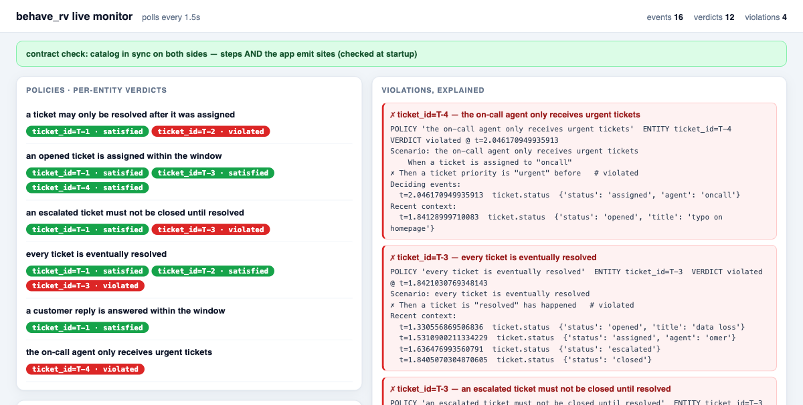
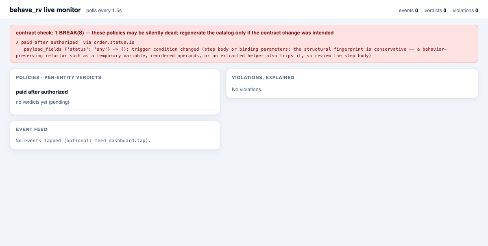

# Using behave_rv in your code — the complete guide

behave_rv watches your running application and tells you, deterministically
and with evidence, whether the rules you wrote in plain Gherkin hold — per
entity, live or over a recorded trace. This guide assumes no familiarity with
the library: it covers the files a monitored project has and how each is
written, every concept and option, how to watch the monitor while your app
runs, and three complete working examples that are committed to this repo and
verified to run.

Setup: `pip install -e .` from a clone (dependencies: `behave`, `parse`).
Nothing else is needed — even the live web dashboard is standard library only.

---

## 1. The files of a monitored project

A project using behave_rv conventionally has this shape (this exact layout is
committed and runnable at [`examples/ticketing/`](../examples/ticketing/)):

```
your_app/
  app_service.py            your business logic, emitting events (a .py file)
  monitoring/
    steps.py                the monitorable surface: registered step predicates
    policies/
      01_resolve_after_assign.feature      one policy per .feature file
      02_assignment_sla.feature
      03_escalation_blocks_closing.feature
      04_every_ticket_resolved.feature
      05_reply_sla.feature
      06_oncall_gets_urgent_only.feature
    catalog.json            the committed step contract (CLI-generated; see §3)
  traces/
    last_week.jsonl         recorded event streams (made by TraceRecorder; §4)
```

**Important, stated up front: there is no magic path discovery.** Unlike
classic `behave` (which auto-discovers a `features/` directory), behave_rv
reads exactly the files you point it at — your code calls
`compile_feature(path.read_text(), registry)` per file, and the CLI takes
`--steps`, `--policies`, `--catalog`, `--trace` arguments. The layout above
is a convention that makes those one-liners, not a requirement the engine
enforces. Nothing breaks if you place files elsewhere; you just pass the
paths you chose.

### Every file type, its rules, and who reads it

| File | Extension / format | Where (convention) | Written by | Read by | Rules |
|---|---|---|---|---|---|
| Policy | `.feature`, Gherkin | `monitoring/policies/`, ONE file per policy, numbered (`01_...`) | a human | `compile_feature(...)` in your code; CLI `--policies` | exactly **one `Feature:` block per file** (the parser refuses multiple); one `Scenario:` = one policy; **scenario names are the policy ids** — unique across all files, and they appear verbatim in verdicts, logs, and dashboards, so write them as readable sentences |
| Steps module | `.py` | `monitoring/steps.py`, next to `policies/` | the developer (or coding agent) | your code (`import`); CLI `--steps` | expose a side-effect-free `build_registry()` factory (the CLI auto-detects it), or register at import via the module decorators; details in §3 |
| Step catalog | `catalog.json`, versioned JSON | next to `steps.py`, **committed to git** | `python -m behave_rv catalog save` | `catalog diff` (the stability check) | never hand-edited; regenerate + commit when a contract change is intended; with `--app` it also records the app's fingerprinted emit sites (the other side of the contract, §7); see [`STABILITY.md`](../STABILITY.md) |
| Trace | `.jsonl`, one JSON event per line | `traces/`, or wherever you record | `TraceRecorder` (live tee), `record_events` (from a list), or any pipeline writing the format | `ReplaySource(path)`; CLI `--trace` | the exact `Event` fields (`type`, `event_time`, `bindings`, `payload`, `source`); event times in seconds; see "Recording traces" in §4 |
| Your app | `.py` (any structure) | anywhere | you | — | the ONLY integration is calling an injected `emit(event)` at observable state changes; the app never imports the engine |

Naming conventions that pay off later:

- **`step_id`**: `<domain>.<event>.<what>` (e.g. `ticket.status.is`) — this is
  the stable identity policies bind to across renames; choose it once, never
  reuse it.
- **event `type`**: `<domain>.<noun>` (e.g. `ticket.status`), a stable
  identity, not a display string.
- **feature files**: numbered prefixes (`01_`, `02_`) keep listings and diffs
  in a stable, readable order.

---

## 2. The five-minute quickstart (single file)

Committed as [`examples/quickstart.py`](../examples/quickstart.py); run it
with `python examples/quickstart.py`.

```python
from behave_rv.catalog.registry import StepRegistry
from behave_rv.compile.compiler import compile_feature
from behave_rv.engine.loop import Engine
from behave_rv.events.event import Event
from behave_rv.events.sources.inprocess import InProcessSource
from behave_rv.verdict.explain import explain_verdict

# -- 1. your app emits events at its state changes (additive: one call) ------
source = InProcessSource()

def set_status(order_id: str, status: str, at: float) -> None:
    # ... your real business logic here ...
    source.emit(Event("order.status", at, {"order_id": order_id},
                      {"status": status}, "my-app"))

# -- 2. one registered step: the vocabulary policies are written in ----------
registry = StepRegistry()

@registry.trigger('an order is "{status}"', step_id="order.status.is",
                  event_type="order.status", correlation_key="order_id")
def order_is(ctx, event, status):
    if event.type == "order.status" and event.payload.get("status") == status:
        ctx.bind(order_id=event.bindings["order_id"])
        return True
    return False

# -- 3. the policy, in plain Gherkin ------------------------------------------
policies = compile_feature("""
Feature: payment safety
  Scenario: an order may only be paid after it was authorized
    When an order is "paid"
    Then an order is "authorized" before
""", registry)

# -- 4. run the app, then the monitor -----------------------------------------
set_status("A-1", "authorized", at=1.0)
set_status("A-1", "paid", at=2.0)          # fine
set_status("B-7", "paid", at=3.0)          # never authorized!

for verdict in Engine(policies, grace=0).run(source, emit_pending=True):
    print(verdict.entity_key, verdict.verdict)
    if verdict.verdict == "violated":
        print(explain_verdict(verdict, policies[0].authored_scenario,
                              policies[0].failing_step_index))
```

Real output:

```
{'order_id': 'A-1'} satisfied
{'order_id': 'B-7'} violated
POLICY 'an order may only be paid after it was authorized'  ENTITY order_id=B-7  VERDICT violated @ t=3.0
Scenario: an order may only be paid after it was authorized
    When an order is "paid"
✗ Then an order is "authorized" before   # violated
Deciding events:
  t=3.0  order.status  {'status': 'paid'}
```

The violation is your own scenario replayed with the failing step marked and
the real events that decided it — that is the library's reporting model
everywhere (logs, CLI, dashboard).

---

## 3. The complete example, file by file: a ticketing app

Everything in this section is committed under
[`examples/ticketing/`](../examples/ticketing/) and runs as shown.

### `app_service.py` — your business logic, with taps

```python
EVENT_TYPE = "ticket.status"      # one stable type for the ticket lifecycle
TERMINAL_TYPE = "ticket.closed"   # ends a ticket's life: settles its policies

class TicketService:
    def __init__(self, emit, clock=time.time):
        self._emit = emit          # injected: tests pass a list.append,
        self._clock = clock        # live passes the real queue and clock

    def _status(self, ticket_id, status, **payload):
        self._emit(Event(EVENT_TYPE, self._clock(), {"ticket_id": ticket_id},
                         {"status": status, **payload}, "ticketing"))

    def open_ticket(self, tid, title): self._status(tid, "opened", title=title)
    def assign(self, tid, agent):      self._status(tid, "assigned", agent=agent)
    def escalate(self, tid):           self._status(tid, "escalated")
    def resolve(self, tid):            self._status(tid, "resolved")
    def close(self, tid):
        self._status(tid, "closed")                       # the observable change
        self._emit(Event(TERMINAL_TYPE, ...))             # then the terminal
```

What to copy from it: `emit` and `clock` are **injected** (same service runs
live and in deterministic tests); one `_status` tap per state change and
nothing else; `close()` emits the observable `"closed"` status *and then* the
terminal event — policies talk about the status, the engine uses the terminal
to settle pending obligations and free the ticket's state.

### `monitoring/steps.py` — the vocabulary (five steps)

```python
POLICY_DIR = Path(__file__).parent / "policies"

def build_registry() -> StepRegistry:
    registry = StepRegistry()

    # 1. the lifecycle step: matches any status by value
    @registry.trigger('a ticket is "{status}"', step_id="ticket.status.is",
                      event_type="ticket.status", correlation_key="ticket_id")
    def ticket_is(ctx, event, status):
        if event.type == "ticket.status" and event.payload.get("status") == status:
            ctx.bind(ticket_id=event.bindings["ticket_id"])
            return True
        return False

    # 2. a SECOND step over the SAME event type, reading a different field
    @registry.trigger('a ticket is assigned to "{agent}"',
                      step_id="ticket.assigned.to",
                      event_type="ticket.status", correlation_key="ticket_id")
    def ticket_assigned_to(ctx, event, agent):
        if event.type == "ticket.status" \
                and event.payload.get("status") == "assigned" \
                and event.payload.get("agent") == agent:
            ctx.bind(ticket_id=event.bindings["ticket_id"])
            return True
        return False

    # 3. a step over its own event type
    @registry.trigger('a ticket priority is "{level}"',
                      step_id="ticket.priority.is",
                      event_type="ticket.priority", correlation_key="ticket_id")
    def ticket_priority_is(ctx, event, level): ...

    # 4 + 5. steps with NO placeholder: the phrasing IS the whole condition
    @registry.trigger('a customer reply arrives', step_id="ticket.reply.inbound",
                      event_type="ticket.reply", correlation_key="ticket_id")
    def customer_reply_arrives(ctx, event): ...

    @registry.trigger('an agent reply is sent', step_id="ticket.reply.outbound",
                      event_type="ticket.reply", correlation_key="ticket_id")
    def agent_reply_sent(ctx, event): ...

    return registry

def load_policies(registry):
    return [p for path in sorted(POLICY_DIR.glob("*.feature"))
            for p in compile_feature(path.read_text(), registry)]
```

(Step bodies 3–5 abbreviated here; the committed file has them in full.)
Notice step 2: several steps may observe the SAME event type with different
conditions — steps are predicates, not one-per-event. Steps 4 and 5 have no
placeholder at all: the phrasing is the entire condition.

The rules a step must obey (each is load-bearing):

- **Pure predicate**: read the event, return `True`/`False`, change nothing.
  Required, not enforced — impurity silently breaks reproducibility.
- The phrasing's `{status}` placeholder binds **by name** to the third
  parameter, so that parameter must be named `status`. It is contract:
  renaming it disconnects every policy (the catalog diff will break loudly
  if you try). The first two parameters `(ctx, event)` are positional — name
  them anything.
- `ctx.bind(...)` is a readability declaration; entity identity actually
  comes from `event.bindings` via the decorator's declared `correlation_key`.
- `build_registry()` as a side-effect-free factory is the recommended style:
  tests get fresh isolated registries, and the CLI detects and calls it
  automatically. (The alternative — module-level
  `from behave_rv.steps import trigger` decorators that register at import —
  also works and is what `examples/order_steps.py` shows.)

### `monitoring/policies/*.feature` — one policy per file

```gherkin
# 01_resolve_after_assign.feature
Feature: assignment discipline
  Scenario: a ticket may only be resolved after it was assigned
    When a ticket is "resolved"
    Then a ticket is "assigned" before
```

```gherkin
# 02_assignment_sla.feature — a wall-clock deadline
Feature: assignment SLA
  Scenario: an opened ticket is assigned within the window
    When a ticket is "opened"
    Then a ticket is "assigned" within "30" seconds
```

```gherkin
# 03_escalation_blocks_closing.feature — an interval scope
Feature: escalation handling
  Scenario: an escalated ticket must not be closed until resolved
    Given a ticket is "escalated" until a ticket is "resolved"
    Then a ticket is "closed" never happens
```

```gherkin
# 04_every_ticket_resolved.feature — settles at the terminal event
Feature: resolution completeness
  Scenario: every ticket is eventually resolved
    Then a ticket is "resolved" has happened
```

```gherkin
# 05_reply_sla.feature — a deadline between the two no-placeholder steps
Feature: conversation SLA
  Scenario: a customer reply is answered within the window
    When a customer reply arrives
    Then an agent reply is sent within "60" seconds
```

```gherkin
# 06_oncall_gets_urgent_only.feature — mixes two steps and two event types
Feature: on-call discipline
  Scenario: the on-call agent only receives urgent tickets
    When a ticket is assigned to "oncall"
    Then a ticket priority is "urgent" before
```

The complete operator reference — all nine forms with satisfying and
violating traces — is [`docs/OPERATORS.md`](OPERATORS.md). Anything outside
the fragment (cross-entity rules, aggregates) is **refused at compile time**
with a clear message; refusal is what makes accepted policies trustworthy.

### `live_monitor.py` — run it live, with the dashboard

Run: `python examples/ticketing/live_monitor.py` and open the printed URL.

```python
policies = load_policies(build_registry())

start = time.time()
source = QueueSource()                       # live: push() is thread-safe
dashboard = Dashboard(policies)
service = TicketService(lambda e: source.push(dashboard.tap(e)),
                        clock=lambda: time.time() - start)   # relative times!

print("monitor:", dashboard.start(port=7007))
engine = Engine(policies, terminal_event_types={TERMINAL_TYPE}, grace=0.5)
threading.Thread(target=lambda: engine.run(source, sink=dashboard.sink),
                 daemon=True).start()

service.open_ticket("T-1", "printer on fire")   # from any app thread
```

The wiring, in words: your app threads push into the `QueueSource`; the
engine consumes on its own single thread; every decided verdict goes to the
dashboard's sink (which only records under a lock); the dashboard's HTTP
server serves snapshots from a daemon thread. Nothing blocks the app. The
seeded traffic in the example produces, live on the page: a healthy ticket
with a full answered conversation (all green), a resolved-without-assignment
violation, an escalated-then-closed violation, and the on-call agent handed
a never-urgent ticket — each rendered as the authored scenario with the
failing step marked.

### `replay_check.py` — the CI shape

Run: `python examples/ticketing/replay_check.py` (exits 1 on violations).
It records a deterministic trace (`FakeClock` — same input, same trace,
byte for byte), replays it through the engine with `emit_pending=True`, and
prints every verdict plus full explanations for violations. Real output ends:

```
31 verdicts, 5 violation(s)
```

Six tickets: the two healthy ones (T-1 with a full answered conversation,
T-4 the urgent/on-call/escalation path) end fully satisfied, and exactly the
five seeded faults are caught — resolve-before-assign, two assignment-SLA
timer firings, the on-call agent given a never-urgent ticket, and a customer
reply never answered (the 60s reply SLA) — with still-open obligations
reported honestly as pending. The suite pins this output
(`tests/test_examples.py`), so the guide cannot drift from reality.

### `monitoring/catalog.json` — what it is, who creates it, when you need it

You will not find this file until you create it, because **it is generated,
not written**: it is NOT part of your code and the monitor does NOT need it
to run. Plainly:

- **What it is**: a JSON snapshot of every registered step's *contract* — the
  event type it observes, its correlation key, the fields it reads, and a
  structural fingerprint of its matching condition (helpers included). Open
  the committed example
  ([`examples/ticketing/monitoring/catalog.json`](../examples/ticketing/monitoring/catalog.json))
  and read it: five step entries, plus an `app_surface` section — the OTHER
  side of the contract: the application's five emit sites, each with its
  event type, keys, payload fields, and a fingerprint of the functions that
  can reach it (§7, "Catching it BEFORE runtime").
- **Who creates it**: you (or CI), by running
  `python -m behave_rv catalog save --steps monitoring/steps.py --catalog monitoring/catalog.json --app app_service.py`
  once, and committing the result (drop `--app` if you only want the step
  side). Never hand-edit it.
- **Its role**: it is the frozen reference that `catalog diff` compares the
  CURRENT code against after every change — so a refactor that silently
  changes what a step matches (and would leave your policies dormant) is
  reported as a break naming the affected policies, while harmless renames
  pass silently. It exists purely for that safety check; skip it and
  everything still runs, you just lose the drift protection.
- **When it changes**: only when you intend a contract change — regenerate
  with the same `save` command and commit the diff alongside the code
  change, like any interface change. Full mechanism:
  [`STABILITY.md`](../STABILITY.md).

### The same project through the CLI

```bash
# run one policy file over a recorded trace
python -m behave_rv --steps examples/ticketing/monitoring/steps.py \
    --policy examples/ticketing/monitoring/policies/01_resolve_after_assign.feature \
    --trace examples/ticketing/trace.jsonl

# the stability check against the COMMITTED catalog (exit 1 on breaks = CI gate)
python -m behave_rv catalog diff --steps examples/ticketing/monitoring/steps.py \
    --catalog examples/ticketing/monitoring/catalog.json \
    --policies examples/ticketing/monitoring/policies
```

---

## 4. The concepts, precisely

### Events

`Event(type, event_time, bindings, payload, source)`:

- `type` — stable event-type identity (`"ticket.status"`).
- `event_time` — seconds, **from the event, never receipt time**. All
  ordering, deadlines, and verdict timestamps use it.
- `bindings` — the correlation key values (`{"ticket_id": "T-1"}`); how the
  engine separates entities. One key per policy; a tuple for composite
  identity is fine; cross-entity policies are refused by design.
- `payload` — the observable fields steps read.
- `source` — provenance label, free-form.

### The engine and every option

```python
engine = Engine(
    policies,
    terminal_event_types={"ticket.closed"},   # entity end-of-life: settles
                                              # pending obligations, frees state
    grace=5.0,             # reorder window in event-time seconds: late events
                           # within it are sorted back into place; grace=0 means
                           # strict arrival order (fast path, no tolerance)
    quiescence_ttl=3600.0, # optional: reclaim entities silent this long
)
verdicts = engine.run(
    source,
    emit_pending=True,     # bounded runs: report still-open obligations as
                           # honest "pending" verdicts at the end
    sink=callable_or_None, # live delivery: each verdict the moment it is
                           # decided (run() then returns []); a raising sink is
                           # recorded and never kills the monitor
)
```

Verdicts are three-valued — `satisfied`, `violated`, `pending` — and carry
`policy_id`, `entity_key`, `verdict`, `trigger_event`, `deciding_events`
(the evidence), `witnessing_trace` (recent context), and `at` (event time of
the decision). If you run `has happened` / `always holds` / `since` policies
with no terminal configured, the engine warns once at startup
(`NoTerminalConfiguredWarning`): they may stay pending forever — a prompt to
configure a terminal, not an error.

### The three sources

| Source | Use for | Notes |
|---|---|---|
| `InProcessSource` | tests, batch checks | `emit(event)`; the run drains it and ends |
| `QueueSource` | **live monitoring** | `push()` thread-safe; `within` deadlines fire on the wall clock during quiet periods; `close()` ends the run |
| `ReplaySource(path)` | recorded `.jsonl` traces | same pipeline as live; write traces with `record_events(path, events)` |

Any object with an `.events()` iterator is a source; add `live = True` plus
`next_event(timeout)` only if its timestamps advance at wall rate.

### Recording traces (where `.jsonl` files come from)

A trace file never appears by itself — something must record it. Three ways:

- **From a live app**: `TraceRecorder` is a pass-through tee you compose into
  your emit chain (exactly like `dashboard.tap`) — every event is appended,
  flushed, replayable:

  ```python
  from behave_rv.events.sources.replay import TraceRecorder

  recorder = TraceRecorder("traces/2026-07-13.jsonl")
  service = TicketService(lambda e: source.push(recorder(e)))
  # ... app runs; later:
  recorder.close()
  ```

  The ticketing example does exactly this — running `live_monitor.py` leaves
  a `live_session.jsonl` you can feed straight back to a replay or to
  `catalog diff --trace`.
- **From a list** (tests, generators): `record_events(path, events)`.
- **From any pipeline** that writes the JSONL shape (one serialized `Event`
  per line) — e.g. an export from your event bus.

So when this guide says "against `last_week.jsonl`", that file is simply a
recording you made earlier by one of these routes, kept because yesterday's
real traffic is the most honest thing to test a policy against.

---

## 5. Watching the monitor while your app runs

### The built-in web dashboard (stdlib, three lines)

```python
from behave_rv.dashboard import Dashboard

dashboard = Dashboard(policies)              # optionally: forward=my_sink
print("monitor at", dashboard.start(port=7007))
engine.run(source, sink=dashboard.sink)
```



Open the URL while the app runs (the screenshot above is the ticketing
example, mid-run): every policy with live per-entity verdict
badges (green satisfied / red violated / "no verdicts yet" = pending),
running counts, and a violations panel where each entry is the authored
scenario rendered with the failing step marked and the deciding events
listed. Wrap your emits with `dashboard.tap(event)` to also see the raw
event feed. The page polls every 1.5s; the sink only records under a lock;
nothing blocks your app.

Two additions answer "could a policy be silently dead?" on the same page:

```python
dashboard = Dashboard(policies, registry=registry,
                      catalog="monitoring/catalog.json")
```

- **The stability strip**: with `registry` and `catalog` given, the dashboard
  runs the contract diff once at startup (code cannot change inside a running
  process) — a green strip says "catalog in sync — no policy can be silently
  broken by a step change"; a red strip names every broken policy with its
  contract diff, exactly like `catalog diff`.
- **The unobserved warning**: if events are flowing (via `tap`) but NONE of a
  policy's event types has appeared, the policy gets an amber
  "⚠ no matching events observed" badge — the runtime smell of a policy
  disconnected from the stream (an app-side rename the static check cannot
  see). It clears the moment a matching event arrives.

### Programmatic status

On the engine, during (from your sink) or after a run: `verdicts_delivered`,
`live_instances`, `late_events` / `dropped_late`, `invalid_events`,
`observed_types` / `observed_values` (the liveness harvest), `retired_keys`,
and two never-fatal error logs — `sink_errors` / `first_sink_error` and
`predicate_errors` / `first_predicate_error` / `predicate_error_sources`
(which policy, which step).

### Stock sinks

`JsonSink(stream)` — one JSON line per verdict; `JsonFileSink(path)` —
appended and flushed, tail-able; `PrintSink(policies)` — violations printed
as full explanations, everything else compact; or any callable.

---

## 6. "How do I KNOW nothing silently broke?"

The failure this library is built to prevent: code changes, a policy stops
matching, and it looks healthy precisely because it stopped working. Three
layers answer it, each with a concrete command or surface:

1. **The validation flag and report — `catalog diff`.** After any code
   change (or as a CI job):

   ```bash
   python -m behave_rv catalog diff --steps monitoring/steps.py \
       --catalog monitoring/catalog.json --policies monitoring/policies
   ```

   Exit `0` = no policy can be silently broken by a step change; exit `1` =
   the printed report names each broken policy with the exact contract diff
   (this repo's own CI runs this on every push). Renames pass silently;
   real contract moves break loudly.
2. **Liveness against real traffic — add `--trace last_week.jsonl`** to the
   same command (the trace being a stream you recorded earlier with
   `TraceRecorder` or `record_events` — see "Recording traces" in §4): warns
   per policy when a value or event type it depends on never appears in a
   representative stream — the check that catches app-side renames the
   static diff honestly cannot see.
3. **The dashboard, live.** Pass `registry=` and `catalog=` and the page
   carries a stability strip (green: in sync; red: the broken policies with
   details) plus per-policy "⚠ no matching events observed" badges driven by
   the actual event flow. So yes — the web monitor shows it. This is what a
   broken contract looks like on the page:

   

### Worked examples: which changes break policies, and which don't

All outputs below are real, produced by running `catalog diff` against the
ticketing example's committed catalog. First, the catalog's role in one
sentence: **the diff only has meaning against the committed snapshot** — it
compares what the steps' contracts ARE now with what they WERE when
`catalog save` last ran, so "regenerate and commit the catalog" is how you
*declare* that a contract change was intended.

#### Change with NO impact: renaming the function and its internals

```python
# BEFORE
def ticket_is(ctx, event, status):
    if event.type == "ticket.status" and event.payload.get("status") == status:
        ctx.bind(ticket_id=event.bindings["ticket_id"])
        ...

# AFTER — function renamed, every internal identifier renamed
def ticket_status_predicate(mctx, incoming, status):
    if incoming.type == "ticket.status" and incoming.payload.get("status") == status:
        mctx.bind(ticket_id=incoming.bindings["ticket_id"])
        ...
```

```
  ticket.status.is: unchanged        (…all five steps: unchanged)
ok: no breaks
```

Nothing observable moved: the step still watches the same event type, reads
the same field, matches the same condition — names are representation, not
contract. Also absorbed: reformatting the body, rewording the phrasing when
the old wording is kept as an alias (`registry.alias(...)`), and renaming or
reordering helper functions. One honest caveat: structural refactors that
*preserve* behavior (introducing a temporary variable, extracting logic into
a helper) DO alarm — the fingerprint is conservative by design, and the
break message says "review the step body"; that costs a glance, where a
missed alarm would cost a dormant policy.

Note what did NOT protect you here: the parameter `status` kept its name.
It binds the phrasing's `{status}` placeholder BY NAME, so renaming *it* is
a real break — and the diff reports it as one.

#### Break type 1: renaming the payload field the step reads

```python
# BEFORE                                          # AFTER
event.payload.get("status") == status             event.payload.get("state") == status
```

```
  ticket.status.is: changed

# BREAKS (4) — scoped to the policies that use the step
  ✗ a ticket may only be resolved after it was assigned  [policies]  via ticket.status.is
    contract: payload_fields {'status': 'any'} -> {'state': 'any'}; trigger condition changed (…)
  ✗ an opened ticket is assigned within the window …
  ✗ an escalated ticket must not be closed until resolved …
  ✗ every ticket is eventually resolved …

FAIL: 4 break(s)
```

Why it breaks: the app still emits `{"status": ...}`, the step now reads a
field that never exists — every event stops matching, and all four policies
built on this step would go dormant while looking healthy. Notice the
scoping: the reply-SLA and on-call policies use OTHER steps and are NOT
notified, even though two of those steps watch the same event type.

#### Break type 2: changing the declared event type

```python
# BEFORE                                          # AFTER
event_type="ticket.status"                        event_type="ticket.lifecycle"
```

```
  ✗ a ticket may only be resolved after it was assigned  [policies]  via ticket.status.is
    contract: event_type 'ticket.status' -> 'ticket.lifecycle'; …
FAIL: 4 break(s)
```

The step now listens for events the app never emits. Same dormancy, same
loud report, same scoping. (A helper-function body change is caught the same
way — the fingerprint follows same-module and same-package calls — with the
break naming the changed helper.)

#### The change the catalog honestly CANNOT see: the app-side rename

The step is untouched; someone edits the SERVICE:

```python
# BEFORE                                          # AFTER
self._status(ticket_id, "resolved")               self._status(ticket_id, "Resolved")
```

`catalog diff` truthfully reports `unchanged` — no step contract moved. The
policies still die: `'a ticket is "resolved"'` never matches `"Resolved"`.
This is what the `--trace` layer exists for. Against a stream recorded from
the changed app:

```
# liveness (…) — against after_rename.jsonl
  ! policy 'a ticket may only be resolved after it was assigned' depends on
    step 'ticket.status.is' with status='resolved', but no 'ticket.status'
    event carrying that value has been observed in the available stream;
    the policy may be uncheckable.
  ! policy 'every ticket is eventually resolved' depends on … status='resolved' …
```

Since the app-surface check exists (§7, "Catching it BEFORE runtime"),
this same edit is also caught statically and earlier: `catalog diff --app`
flags `resolve()` as a behavior-risk the moment the source changes, no trace
needed. Liveness remains the net for causes no static check can see (a
config value, an upstream system renaming what it sends).

Read liveness warnings with its boundary in mind: it flags EVERYTHING the
trace doesn't show, so an unrepresentative trace (one that never exercised
replies, say) warns about those policies too. The signal you act on is the
warning naming the value you just touched. At runtime, the dashboard's
"⚠ no matching events observed" badge is the live form of the same signal.

Full mechanism, worked examples for every path, the measured detection
tables (22 step-side cases, 17 app-side cases), and the stated boundaries
(calls through values, stream representativeness, function-granularity
conservatism): [`STABILITY.md`](../STABILITY.md).

---

## 7. Changes to the APP itself: what the monitor catches at runtime

Section 6 was about protecting the *monitoring surface*. This section answers
the more fundamental question: **when the main application's logic changes,
does behave_rv catch it?** Yes — that is the tool's primary function, not a
stability feature. The division of labor, plainly:

| What changed | Who catches it | How it surfaces |
|---|---|---|
| App logic now BEHAVES differently (skips a step, wrong order, missing action) | **the runtime monitor** — the policies themselves | a `violated` verdict with the explanation, at runtime |
| App refactored, behavior preserved (same events) | nobody, correctly | verdicts identical before and after |
| App renamed its vocabulary (values, types, fields) — behavior "same", spelling different | liveness (`--trace`) + the dashboard's unobserved badge | policies go quiet; the warning names the missing value |
| The monitoring steps/helpers changed | the catalog diff (§6) | a break at build time, before anything runs |
| App code on an EMIT PATH changed (a guard, a helper, an emitted value, a payload field) | `catalog diff --app` — the emit-site impact analysis | a behavior-risk or break at build time, scoped to the policies at risk, before anything runs |

All outputs below are real, from replaying ONE fixed traffic script (open →
assign → escalate → resolve → close) through modified versions of the
ticketing service.

#### An app logic change that breaks a rule → a runtime violation

Someone "optimizes" resolution into a nightly batch job:

```python
# BEFORE                                   # AFTER
def resolve(self, ticket_id):              def resolve(self, ticket_id):
    self._status(ticket_id, "resolved")        self._pending_batch.append(ticket_id)
                                               # resolution deferred to a batch job;
                                               # no "resolved" event at call time
```

The same user actions now violate two policies, each explained with the
authored scenario and the deciding events:

```
POLICY 'an escalated ticket must not be closed until resolved'  ENTITY ticket_id=T-1
VERDICT violated @ t=11.0
    Given a ticket is "escalated" until a ticket is "resolved"
✗   Then a ticket is "closed" never happens   # violated
Deciding events:
  t=7.0   ticket.status  {'status': 'escalated'}
  t=11.0  ticket.status  {'status': 'closed'}

POLICY 'every ticket is eventually resolved'  ENTITY ticket_id=T-1
VERDICT violated @ t=11.001
✗   Then a ticket is "resolved" has happened   # violated
```

No catalog, no diff, no stability machinery involved: the policies watch the
app's *behavior*, and the behavior changed. This works for any logic change
whose effect reaches the event stream — which is exactly what your policies
are written about.

#### An app refactor that preserves behavior → nothing, correctly

Extract `resolve()` into a helper, rename its internals, restructure the
class — as long as the same events come out, the monitor is indifferent:

```
verdicts identical to baseline: True
```

App-internal helpers, class structure, and variable names are invisible on
purpose: the monitor observes events, not code. (Contrast with §6: for the
*step* code, structure does matter, because steps ARE the contract.)

#### A refactor that silently drops a tap → caught from two directions

A rewrite of `assign()` keeps the internal state change but loses the
`_status(ticket_id, "assigned", ...)` emission:

```
 VIOLATED: a ticket may only be resolved after it was assigned   @ t=10.0
 VIOLATED: an opened ticket is assigned within the window        @ t=11.001
```

The dropped emission is not silent, because absence is exactly what these
policies assert about: the `before` rule fires when "resolved" arrives with
no "assigned" in the past, and the SLA timer fires because "assigned" never
came. Liveness adds the second direction: `--trace` against this app's
stream warns that `status='assigned'` is never observed, and the dashboard
shows the unobserved badge. (A dropped tap watched only by quiet-style
`never` policies would NOT self-report at runtime — that is what the
liveness layer is for.)

#### Catching it BEFORE runtime: `catalog diff --app`

Everything above happens at runtime or against a recorded trace. Since the
catalog became two-sided, there is also a purely static net: save the catalog
with your app files once (`catalog save --steps … --catalog … --app
app_service.py`) and every later `catalog diff --app` compares the
application's *emit sites* — every `Event(...)` construction, its event type,
binding keys and payload fields, plus a fingerprint of everything that can
participate in reaching it (the emitting function, its callers, their
callees, the constructor and other methods writing the instance state it
reads, and the module/class constants it references) — against the committed
version. App code is never imported; the analysis is AST-only.

A real example. Someone "cleans up" `assign()` in the ticketing service:

```python
def assign(self, ticket_id: str, agent: str) -> None:
    if agent != "oncall":                                # new guard
        self._status(ticket_id, "assigned", agent=agent)
```

No step changed, no trace needed — the diff answers immediately:

```
# app surface diff (5 emit site(s))
  app_service.TicketService._status#1: behavior-risk
  ...

# APP BEHAVIOR RISKS (1) — logic on an emit path changed
  ! app_service.TicketService._status#1 (event 'ticket.status')
      function(s) in the emit slice changed: app_service.TicketService.assign
      policies at risk: a ticket may only be resolved after it was assigned,
      an escalated ticket must not be closed until resolved, an opened ticket
      is assigned within the window, every ticket is eventually resolved,
      the on-call agent only receives urgent tickets

ok: no breaks (1 app behavior risk(s) above)
```

Three levels, by severity: an **interface break** (an emitted event type,
binding key, or payload field changed, or an emission was deleted) exits 1
and gates CI exactly like a step break; a **behavior risk** (the logic
deciding *when or what* is emitted changed) warns by default and gates under
`--fail-on-app-risk`; a **new emit site** surfaces as an addition nothing
observes yet. Renames of locals, parameters, classes, and docstring/comment
edits are absorbed silently; renaming a function on an emit path flags
conservatively, because callable identity pins emission order.

Be clear about what this is: a *may-affect* analysis, not a verdict. It reads
code structure, so behavior driven by runtime data (config, database
contents, request payloads) is invisible to it, and its conservatisms are
measured and declared (the 17-case E-series in
[`STABILITY.md`](../STABILITY.md), an 83-mutant adversarial campaign with
zero misses, and a replay of this repo's own git history with every
classification correct — full honest results in
[`APP_SURFACE_EVALUATION.md`](APP_SURFACE_EVALUATION.md)). It is the
earliest net, not the last one — the runtime layers above remain the ground
truth.

#### The honest boundary: the monitor never "knows" the code changed

Be precise about what the runtime layer is: it verifies **executions, not
programs**. At runtime nothing analyzes your application's source, and a
violation is a statement about this execution, not a diagnosis that code
changed — the monitor cannot tell "the code changed" apart from "the code was
always wrong and this input finally hit it." (The `--app` check above is the
build-time complement: it does read source, and says "may affect", never
"violated".) Runtime detection of an app change is therefore conditional on
three things stacking:

1. **Observability** — the change's effects must reach the event stream. A
   corrupted internal calculation no emitted field carries is invisible.
   Compensation: the over-expose convention (emit state transitions, status
   enums, boundary crossings generously — an unused tap is cheap, a missing
   one is a policy nobody can ever write).
2. **Coverage** — some policy must constrain the changed behavior. No rule,
   no signal.
3. **Exercise** — the violating situation must actually occur in observed
   traffic. A bug on the escalation path is silent until something
   escalates; until then the policy is pending — honestly undecided, not
   "verified safe."

Two build-time nets close most of the exercise gap. `catalog diff --app`
flags emit-path code changes with zero traffic, at the price of "may affect"
rather than "did affect". And **supplying the exercise yourself** — a fixed
scripted traffic set through every build (the `replay_check.py` pattern,
exit-coded for CI) — turns any behavior change on a covered path into a
verdict change before live traffic finds it. Static analysis for the code-
visible causes, scripted replay for the behavioral ground truth: together
they are the closest thing to "knowing the app changed" that an
execution-verifier can honestly offer.

---

## 8. Gotchas, honestly

- **Event time is the clock.** Ordering, deadlines, and verdicts use
  `event_time`, never arrival time.
- **Ordered actions need distinct timestamps.** With `grace > 0`, events with
  EQUAL times are ordered canonically (by content), not by arrival — so two
  actions whose order matters must not share a timestamp. Tick your clock
  between them (the ticketing example shows this; its first draft had the
  bug and produced spurious verdicts).
- **Live mode wants small timestamps.** A known open issue makes wall-clock
  deadline firing unreliable at Unix-epoch magnitudes; in live mode emit
  service-relative times (`time.time() - START`), as the examples and demos
  do. Replay and batch runs are unaffected.
- **Purity is on you.** Steps must be deterministic and side-effect free;
  the framework expects but cannot enforce it.
- **`pending` is honest, not stuck.** Unbounded obligations settle at the
  entity's terminal event, or report as `pending` when a bounded run ends.
- **Scenario names are ids.** Duplicate names are refused at compile time;
  keep them unique and readable — they are what you'll see in every verdict.
- **One `Feature:` per `.feature` file.** The parser refuses multiple.

---

## 9. Where to go deeper

[`docs/OPERATORS.md`](OPERATORS.md) — every operator, with traces ·
[`SEMANTICS.md`](../SEMANTICS.md) — formal trace semantics ·
[`STABILITY.md`](../STABILITY.md) — the code-change defenses ·
[`MUTATION.md`](../MUTATION.md) — how the suite itself is validated ·
[`demo/README.md`](../demo/README.md) — three complete demo apps with
interactive boards and a stability panel.
